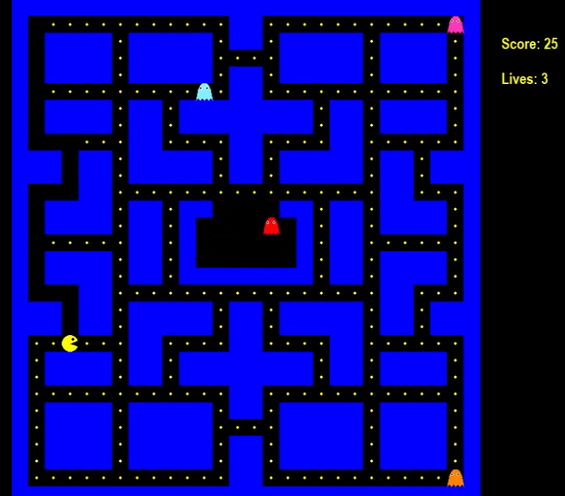

## PACMAN REVISITED

#### Description:
This is a recreation of the arcade game Pacman. It was built in python, using the pygame library.

The game is designed using Object Oriented Programming, so each character of the game and the background are all objects and contain their own functions.

There are 3 main classes:

The Pacman class is responsible for drawing the pacman on the screen and also for controlling pacman's moves.

The Ghost class is shared by all the ghosts, and it's responsible for drawing the ghosts and controlling the ghost's movements.

Since the ghosts move randomly through the background, this class is rensponsible for randomly picking what are the next move for the ghosts.

The Background class controls the scenario and the dynamics of the game.

Not only does it control the creation of the background but also controls player's lives and scores as well as communicating with the ghost and pacman's classes so those classes can be aware of their location in 
the background.

The game also contains a few states, which are "play", "pause", "gameover" and "win". 

Depending on the state of the game, it will have a different behavior.

#### Usage
python3 pacman_final.py

#### Requirements
It uses pygame library, so make sure to install it with: pip install pygame

#### About the game
"Pac-Man is an action maze chase video game; the player controls the eponymous character through an enclosed maze. 
The objective of the game is to eat all of the dots placed in the maze while avoiding four colored ghosts that pursue him. 
When Pac-Man eats all of the dots, the player advances to the next level. 
If Pac-Man makes contact with a ghost, he will lose a life; the game ends when all lives are lost. 

Placed at the four corners of the maze are large flashing "energizers", or "power pellets". Eating these will cause the ghosts to turn blue with a dizzied expression and reverse direction. 
Pac-Man can eat blue ghosts for bonus points; when eaten, their eyes make their way back to the center box in the maze, where the ghosts "regenerate" and resume their normal activity. 
Eating multiple blue ghosts in succession increases their point value. After a certain amount of time, blue-colored ghosts will flash white before turning back into their normal, lethal form. 
Eating a certain number of dots in a level will cause a bonus item - usually in the form of a fruit – to appear underneath the center box, which can be eaten for bonus points."

- Description taken from Wikipedia.

This game is a simplier version. I was not able to implement a few details yet, however I intend to keep working on it.

Among the things that need to be improved or implemented are:

- Ghosts are currently moving randomly, but they should actually chase pacman
- The energy balls that makes the ghosts run are still not implemented
- The game currently has only one level, so other levels need to be implemented.
- Some little bugs still need fixing.
